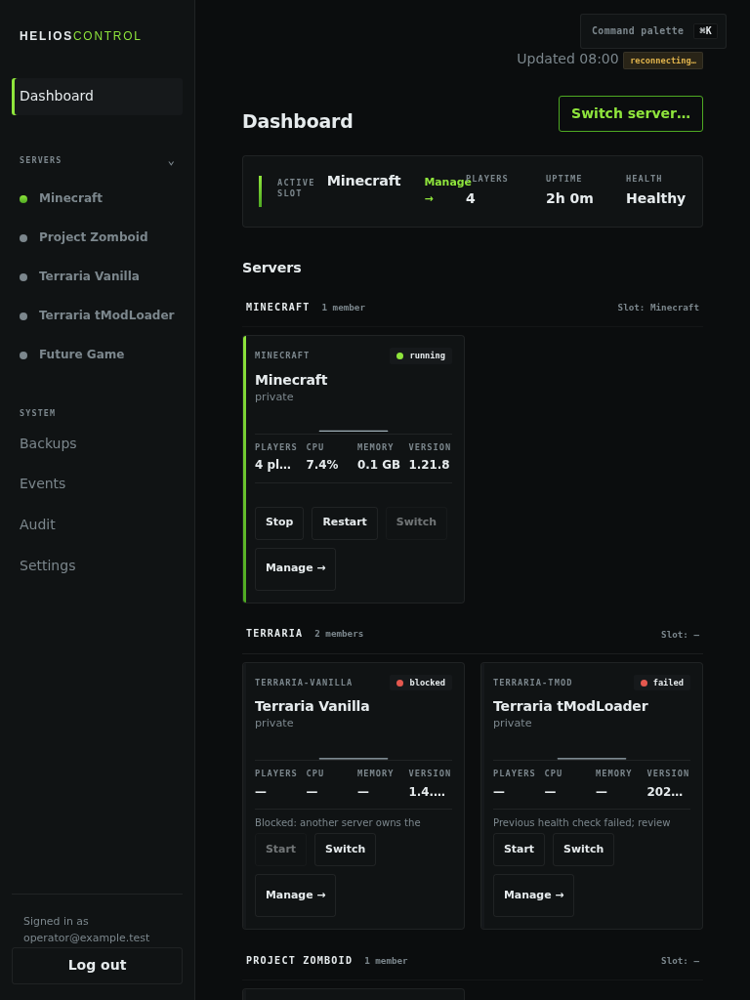

# Helios Horizon

[](https://github.com/VirgoAgario/helios-horizon/actions/workflows/ci.yml)
[](LICENSE)

Helios Horizon is a security-focused control plane for a host that runs one resource-intensive game server at a time. It coordinates Minecraft, Project Zomboid, Terraria, and tModLoader behind one typed controller instead of letting the web process invoke arbitrary shell commands.



> The screenshots and checked-in configuration use synthetic data and documentation-only addresses. This repository contains no production credentials, player database, worlds, backups, or live infrastructure inventory.

## What it demonstrates

- **Fail-closed control boundary:** FastAPI talks to a privileged controller over a fixed Unix socket and typed newline-delimited RPC.
- **Single-slot orchestration:** starts, stops, restarts, and switches are serialized so mutually exclusive game servers cannot own the heavy-resource slot together.
- **Bounded operations:** profile IDs, units, paths, ports, console transports, timeouts, and update strategies come from reviewed configuration rather than request-supplied shell text.
- **Layered web security:** reverse-proxy credential verification, forwarded identity, expiring server-side sessions, CSRF tokens, strict origin checks, and credential redaction.
- **Recovery-aware workflows:** verified backups, prepare/confirm restore and world-clone flows, rollback-aware switching, and append-only audit records.
- **Operator visibility:** SSE status updates, logs, events, metrics, player sessions, TPS/MSPT telemetry, scheduled switches, and idle shutdown.
- **Deployment hardening:** unprivileged service accounts, systemd sandboxing, fixed writable paths, `NoNewPrivileges`, protected homes, and root-owned runtime locks.
- **Reference operations surfaces:** sanitized examples for loopback-only RCON console control, save-off/flush/save-on online backups, bounded TPS scraping, fixed-profile LazyMC capability wake, and protected B2 reconciliation.

## Architecture

```text
Authenticated operator
        │
        ▼
Reverse proxy / SSO
        │ fixed proxy credential + identity headers
        ▼
FastAPI + static web UI (unprivileged)
        │ typed RPC over /run/game-control/control.sock
        ▼
Slot controller (privileged, peer-credential checked)
        │
        ├── Crafty adapter ── Minecraft
        └── fixed systemd profiles ── PZ / Terraria / tModLoader
```

The web tier cannot choose a socket, unit, executable, or filesystem path. Mutation requests additionally require a valid session, CSRF token, and approved origin. See [architecture](docs/architecture.md) and [security model](docs/security-model.md).

## Repository layout

- `src/game_control/` — controller, RPC protocol, API, auth, scheduling, backup, telemetry, and adapters
- `web/` — dependency-free JavaScript/CSS dashboard
- `config/` — sanitized example profiles and runner definitions
- `ops/` — installer, hardened systemd units, and fixed console helpers
- `tests/` — unit, integration, packaging, security-boundary, and Playwright browser tests
- `docs/` — public-safe architecture and deployment guidance

## Local verification

Requirements: Python 3.11+, [`uv`](https://docs.astral.sh/uv/), and a Chromium-compatible Playwright runtime.

```bash
uv sync --frozen --extra test --python 3.11
uv run --frozen --extra test --python 3.11 playwright install chromium
uv run --frozen --extra test --python 3.11 pytest -q
```

To run only the non-browser suite:

```bash
uv run --frozen --extra test --python 3.11 pytest -q --ignore=tests/browser
```

## Deployment warning

The files under `config/` and `ops/` are reviewed examples, not a turnkey deployment. A real installation must supply its own service users, paths, SSO/proxy boundary, Crafty token, game-server installation, firewall rules, backups, and restore testing. The web service binds to loopback by default. Never expose it directly to the internet or commit generated configuration and secrets.

See [example deployment guidance](docs/deployment-example.md) before adapting the installer.

The H1/H2/G11 operational contracts are described in the
[public operations examples](docs/operations-example.md). Those examples use
synthetic Sunlit profile data, documentation-only addresses, and runtime-only
secret paths; they are not installed by the baseline example installer.

## License

MIT — see [LICENSE](LICENSE).
